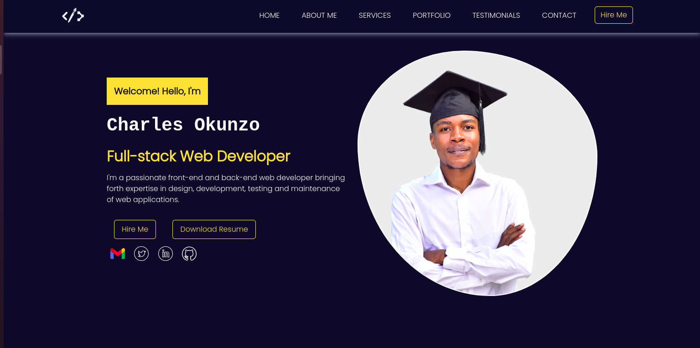

# PORTFOLIO.V.2.0
#### By Charles Okunzo, June 24, 2022
### This application documents my professional portfolio in software development.


## Table of Contents
+ [Description](#description)
+ [Installation Requirements](#installation)
+ [Technologies Used](#technology)
+ [Lisence](#lisence)
+ [Authors Info](#author)

## Description
This application documents my professional portfolio in software development.
    A user can:

- Be able to view my profile
- View my education history
- View the services that I offer
- View the projects that I have performed in the past half year and their live links
- Find my contact info as well as be able to send a message via the app.
- Fill a form to hire create a digital product for them.
...
```
Landing Page
```



[Go Back to the top](#portfoliov20)

## Getting Started

To clone the repository, run:

    git clone https://github.com/charles-okunzo/portfolio.v.2.0

Then navigating to the cloned directory:

    cd portfolio.v.2.0


### Prerequisite
This project requires a prerequisite understanding of the following:
- Django Framework
- Python3.8
- Postgres
- Python pipenv
- Makefile


## Setup and installation

###  Activate virtual environment
Activate virtual environment using python3.8 as default handler
    `pipenv shell`
####  Install dependancies
Install dependancies that will create an environment for the app to run from `Pipfile`
####  Create the Database
    - psql
    - CREATE DATABASE portfolio;
####  .env file
Create .env file and paste the following, filling where appropriate:

    SECRET_KEY = '<secret_key>'
    DB_NAME = '<db_name>'
    DB_USER = '<username>'
    DB_PASSWORD = '<password>'

#### Run initial Migration
    make migrate
    
#### Run the app
    make run or make
    
    Open terminal on localhost:

[Go Back to the top](#portfoliov20)
    
## Deployment

The application is deployed on Heroku and is live on this [Link](https://okunzo-charles-dev.herokuapp.com/)

## Technologies Used

  - [Django 4.0.5](https://docs.djangoproject.com/en/4.0/releases/4.0.4/) - Backend logic of the application and views.
  - [Bootstrap](https://getbootstrap.com/) - Used for overall design and responsive site


## Known Bugs
No known bugs.


## Licence

copyright (c) 2022 MIT License. [View License Here](LICENSE)

[Go Back to the top](#portfoliov20)

## Authors Info

* Slack Profile - [Charles Okunzo](https://app.slack.com/client/T0101L740P4/C010GLANY3A/user_profile/U02TTFQ0VJR)
* Email address - [Charles Okunzo](charles.okunzo@student.moringaschool.com)